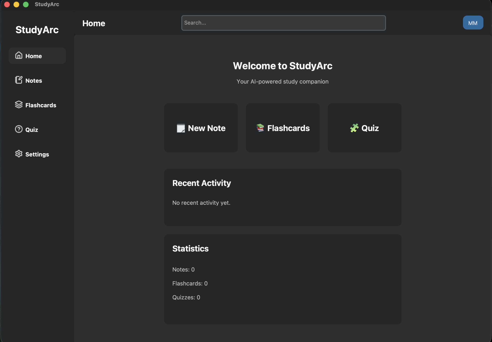

# StudyArc

<p align="center">
  
</p>

## Overview

StudyArc is an AI-powered desktop study assistant built with Python to help students organize knowledge, improve learning workflows, and create personalized study experiences.

The goal is to combine modern software engineering practices with AI-powered learning tools to build a scalable study companion.

---

## Architecture

StudyArc follows a modular architecture designed for scalability and maintainability.

```text
StudyArc

├── Presentation Layer
│   └── Desktop UI (CustomTkinter)

├── Service Layer
│   └── Application Logic

├── Data Layer
│   └── Models & Database

└── AI Layer
    ├── Document Processing
    ├── Retrieval System
    ├── Embeddings
    └── LLM Integration
```

The project focuses on separation of concerns, reusable components, and clean system design.

---

## Technology Stack

| Area | Technology |
| --- | --- |
| Language | Python |
| Desktop UI | CustomTkinter |
| Image Processing | Pillow |
| Database | SQLite |
| Version Control | Git & GitHub |
| AI | LLMs, RAG, Embeddings *(planned)* |

---

## AI Vision

StudyArc aims to transform personal study materials into intelligent learning experiences.

Planned AI capabilities:

- AI-powered knowledge assistant
- Document-based question answering
- Automatic summaries
- Flashcard generation
- Quiz generation
- Personalized learning support

The AI system will be built around Retrieval Augmented Generation (RAG), semantic search, and large language models.

---

## Development

StudyArc is actively under development.

The project is built incrementally with a focus on:

- Clean architecture
- Maintainable code
- Scalable design
- Practical software engineering principles

For detailed progress and milestones:

- `docs/ROADMAP.md`
- `docs/PROJECT_STATUS.md`
- `docs/CHANGELOG.md`

---

## License

This project is currently under development.